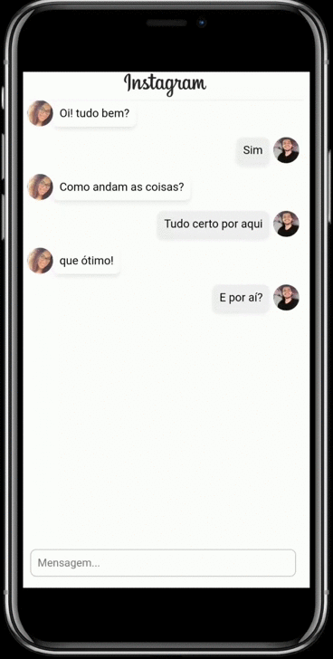
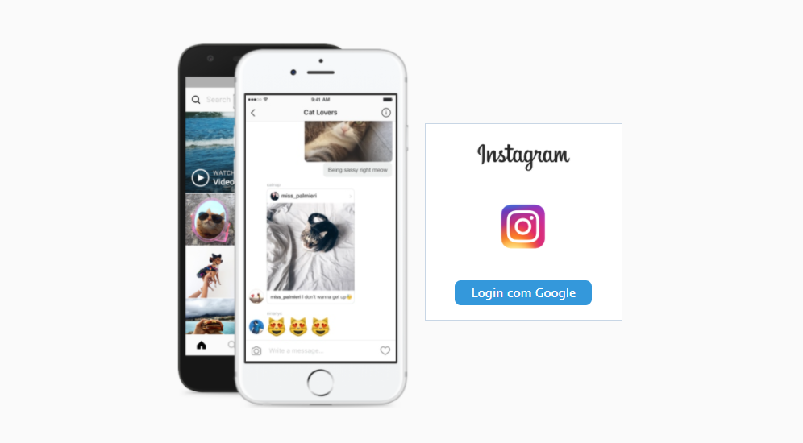

<h1 align="center">
  
</h1>

<p align="center">
  
  
  
  
</p>

<p align="center">
  <a href="#page_with_curl-sobre">Sobre</a>&nbsp;&nbsp;&nbsp;|&nbsp;&nbsp;&nbsp;
  <a href="#hammer-tecnologias">Tecnologias</a>
  &nbsp;&nbsp;&nbsp;|&nbsp;&nbsp;&nbsp;
  <a href="#books-requisitos">Requisitos</a>&nbsp;&nbsp;&nbsp;|&nbsp;&nbsp;&nbsp;
  <a href="#rocket-começando">Começando</a>&nbsp;&nbsp;&nbsp;|&nbsp;&nbsp;&nbsp;
  <a href="#thought_balloon-inspiração">Inspiração</a>
</p>

<h1 align="center">
  
  
  
</h1>

## :page_with_curl: Sobre
Este repositório foi criado para atender aos requisitos de um teste imposto por uma empresa.

"NPL - Direct" é uma aplicação web responsiva que permite que o usuário faça login com a conta do google para acessar um chat baseado no Instagram Direct.

## :hammer: Tecnologias

Este projeto foi desenvolvido com as seguintes tecnologias:

- [ReactJS](https://pt-br.reactjs.org/)
- [Firebase](https://firebase.google.com/)
- [Styled-components](https://styled-components.com/)
- [VS Code](https://code.visualstudio.com/) com [EditorConfig](https://editorconfig.org/), [ESLint](https://eslint.org/) e [Prettier](https://prettier.io/)

## :books: Requisitos
- Ter [**Git**](https://git-scm.com/) para clonar o projeto.
- Ter [**Node.js**](https://nodejs.org/en/) instalado.
## :rocket: Começando
``` bash
  # Clonar o projeto:
  $ https://github.com/CelsoJunioDev/npl-direct

  # Entrar no diretório:
  $ cd npl-direct
  
  # Instalar as dependências:
  $ yarn
```

## :gear: Iniciando servidor
```bash
  $ yarn start
```

# :thought_balloon: Inspiração
- Design inspirado na página oficial do [Instagram](https://www.instagram.com).

Feito por Celso Junio. 👋🏻 [Get in touch!](https://github.com/CelsoJunioDev)
